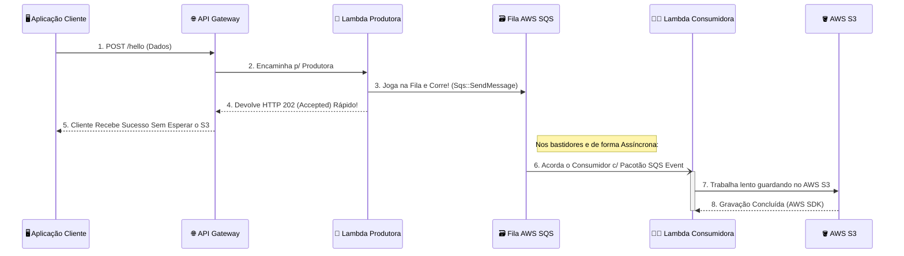

# ☁️ SQS & S3 LocalStack (Serverless Message Broker)

Atendendo às necessidades de arquiteturas robustas e escaláveis, introduzimos mensagens assíncronas no sistema (Fila!). Tudo operando 100% no servidor falso de testes LocalStack.

---

## 🏗️ Como Funciona o Novo Fluxo com Fila (SQS)?

Imagine novamente o nosso antigo Restaurante Fast-Food (O Frontend). Mas desta vez, o nosso Cozinheiro (A Função Lambda original) ficou abarrotado de serviço, travando na hora de guardar centenas de pacotes grandes no S3 na sexta-feira à noite e demorando para entregar a Notinha (Retorno 201) pro Cliente.

Como resolver isso? Criamos uma **Fila de Tickets** para desmembrar o fluxo em duas etapas (Produtor x Consumidor)!

1. **📱 O Cliente (Frontend)**
   O Front end não aguarda mais a gravação demorada do "Pacote no Estoque S3". Ele avisa o Garçom que quer mandar um item.

2. **🤵‍♂️ O Garçom (API Gateway)**
   Roteia a sua comanda até o "Caixa" da cozinha.

3. **📝 Lambda Produtora ("O Caixa")** `[src/producer.ts]`
   Assim que recebemos do API GW, o "Caixa" só faz duas coisas:
   a) Cola os dados do seu upload literalmente em um Post-it (_Message_)
   b) Joga na Fila SQS e responde na mesma hora: *"Pode ir, Sr. Cliente (Retornando Http *202 Accepted*)! Seu pedido já está na esteira!"*

4. **🗃️ O Quadro de Fila SQS (Simple Queue Service)**
   A fila fica enfileirando todos os Post-its com requisições que chegam do Frontend. Eles podem chegar aos milhares. A SQS garante que nenhum papel seja rasgado ou perdido!

5. **👨‍🍳 Lambda Consumidora ("O Repositor de Estoque")** `[src/consumer.ts]`
   Esta SEGUNDA (nova) AWS Lambda trabalha totalmente nos fundos, fora da visão do cliente.
   Sempre que cai algo na "Fila", essa Lambda de estoque é acordada (_Lambda Trigger_). Ela pega 10 papéis da fila por vez, lê o texto que você inseriu neles e envia eles para nosso antigo Estoque S3 (`meu-bucket-arquivos`) no tempo dela!



---

## 🚀 Como Simular Isso Agora?

Basta configurar a sua própria Infra local na seguinte sequência:

### 1. Preparar a Infraestrutura e o Setup Local (IaC)

No seu terminal, digite o seguinte comando por comando. De quebra, apredemos a utilidade de cada ferramenta oficial de Devops do Localstack.

```bash
# 1. Instala as dependências novas do AWS SDK da SQS
npm install

# 2. Cria o Salão de Estoque do S3 como já faziamos
npm run s3:local

# 3. Compilação TypeScript e Cadastro das DUAS as Lambdas (O Caixa e o Repositor) pelo "aws lambda create-function"
npm run deploy:local

# 4. **A MÁGICA SURGE** - O Quadro de Filas (A SQS).
# Ele cria a Fila e já ensina ela a injetar mensagens diretamente no Repositor "Consumer" (Event Source Mapping).
npm run sqs:local

# 5. O Garçom (A URL). Aponta todas as rotas da Web pro "Caixa/Producer".
npm run api:local
```

_(⚠️ Guarde aquela URL do "Postman" que esse último comando jogar na tela)_

### 2. Brinque no Frontend de Forma Assíncrona!

```bash
# Roda a UI
npm run dev
```

1. Acesse `http://localhost:5174/` e abra a aba "Network" e os "Logs/Terminal" do Docker caso queira analisar o que muda em velocidade.
2. Agora, toda vez que apertar p/ enviar, o tempo de reposta da interface será o triplo mais rápido pois ela caiu na fila sem testar se a Amazon tava disposta a salvar naquele exato segundo em disco!
3. Você pode usar sua AWS CLI `aws --endpoint-url=... s3 ls` pra atestar que em algum momento não listado no frontend o S3 foi atualizado!
