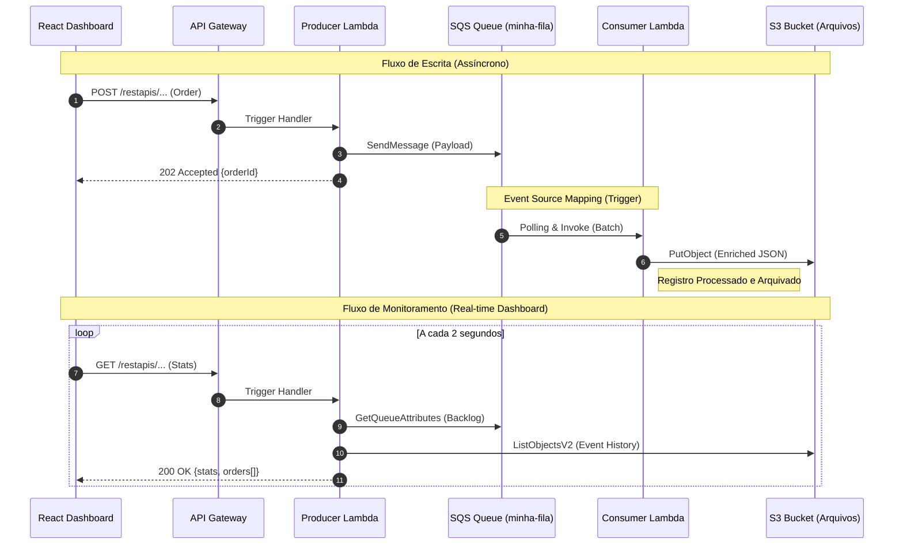

# 🏗️ Technical Specification: AWS SQS Cloud Ecosystem

Este projeto implementa um ecossistema **Serverless** de alta performance, focado em **Arquitetura Event-Driven** e **Processamento Assíncrono**. A aplicação simula o ciclo de vida completo de um pedido de e-commerce: desde o recebimento via API Gateway até a persistência final em S3, utilizando uma fila SQS como amortecedor de carga e garantindo o desacoplamento total entre o produtor e o consumidor.

---

## 🔄 Fluxo de Dados: Processamento de Pedidos e Eventos

O diagrama abaixo detalha a coreografia de eventos. O **Produtor** libera o usuário quase instantaneamente (202 Accepted), enquanto o **Consumidor** processa o trabalho pesado em segundo plano através de gatilhos automáticos do SQS.



---

## 📩 Detalhes do Processamento de Fila (SQS)

A fila **SQS (Simple Queue Service)** atua como o sistema circulatório da aplicação. Ela não é apenas um local de armazenamento, mas um **disparador de eventos**.

- **Producer Side**: Ao receber um POST, a Lambda Producer valida o pedido e o despacha para o SQS. A mensagem contém o ID do pedido, o produto e a data de criação.
- **Event Source Mapping (Trigger)**: Nós configuramos um gatilho na Lambda Consumer. A AWS (ou LocalStack) monitora a fila constantemente. Assim que uma mensagem entra, o SQS invoca a Lambda Consumer automaticamente.
- **Batch Size**: O sistema está configurado com `batch-size 10`, o que significa que se houver muitos pedidos, a Lambda pode processar até 10 mensagens de uma só vez, otimizando custos e performance.
- **Visibility Timeout**: Enquanto a Consumer está processando um pedido, a mensagem fica "invisível" para outros consumidores, garantindo que o mesmo pedido não seja processado duas vezes.

---

## 🔩 Backend: Clean Architecture & Portabilidade

O projeto utiliza **Clean Architecture** para separar as regras de negócio da tecnologia de nuvem. Isso permite trocar o LocalStack pela AWS real sem alterar o coração do sistema.

- **Domain (`src/domain/`)**: Contém as Entidades (`Order`, `SystemStats`). É o código mais puro do projeto.
- **Application (`src/application/`)**: Define as Interfaces (`Gateways`) e os Casos de Uso. Aqui reside a orquestração do que deve ser feito.
- **Infrastructure (`src/infrastructure/`)**: Implementa a conexão real com SDKs. Utilizamos a lógica **Smart SDK** que detecta o ambiente (Local vs Cloud) automaticamente.
- **Presentation (`src/presentation/`)**: Os Handlers das Lambdas que traduzem eventos da AWS para comandos do sistema.

---

## 📦 Lifecycle de Deploy: LocalStack vs AWS Real

Embora utilizemos o `start.sh` para facilitar o desenvolvimento local, o projeto foi construído pensando em um pipeline de produção profissional.

### Como o código é preparado (Build):

1.  **TypeScript Transpiling**: O código é convertido para JavaScript compatível com o runtime `nodejs18.x`.
2.  **Path Alias Resolution**: Utilizamos o `tsc-alias` para traduzir os caminhos `@src/*` em caminhos relativos dentro do `dist/`. Isso permite manter o código limpo no desenvolvimento e funcional no ZIP final.
3.  **Arquivamento**: Todo o conteúdo da pasta `dist/` é compactado em um `function.zip`. Note que o Producer e o Consumer vivem no mesmo ZIP, mas são invocados por **Handlers diferentes**.

### Estratégia de Deploy em Produção:

Para subir na AWS real de verdade, os passos seriam:

1.  **Provisionamento**: Recomendamos o uso de **AWS CDK** (TypeScript) para criar o S3, SQS, API Gateway e as IAM Roles.
2.  **IAM Roles (Permissões)**: Na AWS real, as Lambdas precisam de "permissão explícita" para ler da fila e escrever no bucket.
3.  **CI/CD**: Um pipeline no GitHub Actions executaria `npm run build`, geraria o ZIP e usaria o comando `aws lambda update-function-code` para atualizar o código na nuvem.
4.  **Frontend**: O dashboard React (Vite) seria buildado e enviado para um **Bucket S3 Estático** servido pelo **AWS CloudFront (CDN)** para máxima performance.

---

## 🚀 Como Executar Localmente

O projeto possui um **Modo Full Dev** que sobe tudo de uma vez:

```bash
npm run dev:full
```

Este comando executa:

1.  **`start.sh`**: Sobe o docker (LocalStack), cria o Bucket, a Fila, a Fila e as Lambdas.
2.  **`watch:local`**: Inicia o `nodemon` que vigia a pasta `src/`. Se você mudar o código do backend, ele faz o build e o deploy na Lambda local automaticamente!
3.  **`vite`**: Sobe o painel de controle React.

---

**Developed with Precision & Scalability in mind.**
