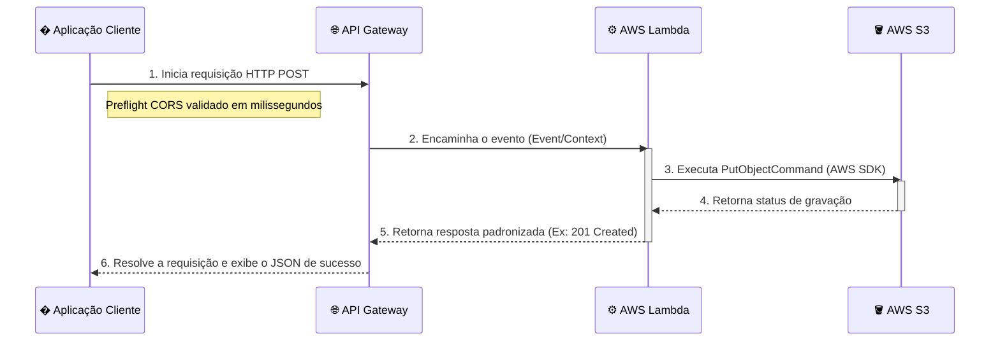

# ☁️ S3 LocalStack Serverless Uploader

Este repositório demonstra a construção de uma aplicação _Full-Stack Serverless_ operando inteiramente em ambiente local. A arquitetura simula com precisão serviços da Amazon Web Services (AWS) utilizando o **LocalStack**, orquestrando uma comunicação ponta a ponta desde uma interface web (Frontend) até o armazenamento em nuvem (Backend).

---

## 🏗️ Arquitetura e Fluxo de Dados

A infraestrutura é desenhada utilizando os seguintes componentes principais da nuvem:

1. **🧑‍� Aplicação Cliente (Vite/TailwindCSS):**
   Interface de usuário (Frontend) desenvolvida em TypeScript. Captura os dados inseridos pelo usuário (nome e conteúdo do arquivo) e aciona a API de backend através de requisições assíncronas (HTTP POST).

2. **🌐 AWS API Gateway:**
   Atua como o ponto de entrada (roteador) seguro da infraestrutura. O API Gateway gerencia o tráfego de rede, lida com as permissões de segurança de navegadores (CORS/Preflight Headers via método `OPTIONS`) e encaminha a requisição de upload validada para o processamento.

3. **⚙️ AWS Lambda (Node.js/TypeScript):**
   A camada computacional. Nossa função _Serverless_ (`src/handler.ts`) recebe o pacote do Gateway, processa o arquivo JSON em memória, instancia o SDK oficial da AWS e submete o objeto formatado ao serviço de armazenamento.

4. **🪣 Amazon S3 (Simple Storage Service):**
   O serviço de persistência de dados. Recebe o conteúdo processado pela AWS Lambda e o grava definitivamente de forma segura dentro de um _Bucket_ (um contêiner virtual de armazenamento).

### Diagrama de Sequência (Ponta a Ponta)



---

## 🛠️ Tecnologias e Ferramentas

- **Infraestrutura Cloud Simulado:** Docker e [LocalStack](https://localstack.cloud/)
- **Backend:** Node.js, TypeScript, AWS SDK v3, Jest (Testes Unitários Unitários com Mocking)
- **Frontend:** Vite, TypeScript, TailwindCSS v4
- **Automação:** Shell Scripts Integrados (`package.json`)

---

## � Guia Rápido de Instalação e Execução

Todo o fluxo de provisionamento (_IaC - Infrastructure as Code_) de certa forma foi abstraído através de _scripts_ construídos para facilitar os estudos locais.

### 1. Iniciar o Simulador de Nuvem

Certifique-se de que o Docker está operando na sua máquina e inicie os contêineres:

```bash
docker compose up -d
```

_(O LocalStack alocará seus serviços simulados na porta 4566 do painel localhost)._

### 2. Provisionamento (Deploy) da Infraestrutura

Na raiz do projeto em seu terminal, execute rigorosamente a ordem abaixo para provisionar os serviços na AWS simulada:

```bash
# Etapa 1: Cria o "Cofre" permanente no Amazon S3
npm run s3:local

# Etapa 2: Compila a função Lambda e a entrega compactada (.zip) para a AWS
npm run deploy:local

# Etapa 3: Cria as rotas e regras de HTTP (CORS) no API Gateway e devolve uma URL
npm run api:local
```

> ⚠️ **Atenção:** O último comando (`api:local`) gerará uma URL exclusiva para o Gateway (Ex: `http://localhost:4566/restapis/XXX/dev/_user_request_/hello`). **Copie e guarde esta URL.**

### 3. Iniciar a Interface Gráfica

Com a infraestrutura provisionada, inicie o servidor de desenvolvimento do Frontend:

```bash
npm run dev
```

1. Acesse `http://localhost:5174/` utilizando seu navegador de preferência.
2. Insira a **URL do API Gateway** copiada no Passo 2 no campo correspondente.
3. Preencha os detalhes do arquivo e simule um envio de dados para ambiente de produção (local)!

### 🧪 Observações sobre Ciclo de Desenvolvimento (Testes Unitários)

Para testar isoladamente as regras de negócio escritas na função Lambda através do Jest sem depender de instâncias Docker:

```bash
npm run test
```

Sempre que efetuar mudanças no código-fonte `src/handler.ts`, utilize **`npm run update:local`** para enviar as atualizações sem a necessidade de recriar os provisionamentos do zero.
