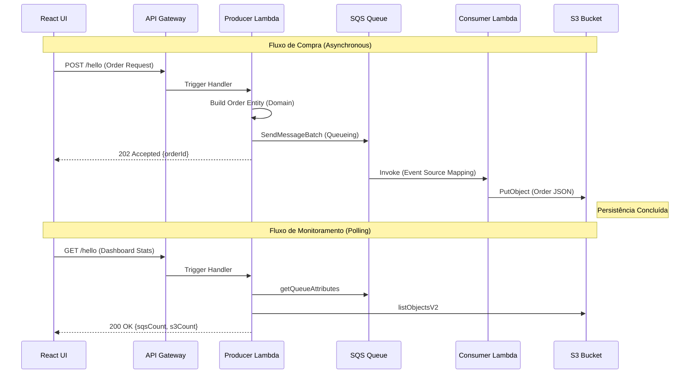
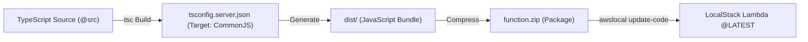

# 🏗️ Technical Specification: AWS Serverless LocalStack Ecosystem

Este projeto implementa um ecossistema **Serverless** completo de alta disponibilidade, focado em **Processamento Assíncrono** e **Arquitetura Desacoplada**. Utiliza **LocalStack** para emulação de infraestrutura AWS, **TypeScript** com **Clean Architecture** no backend e **React 18** com **Custom Hooks** no frontend.

---

## 🌩️ System Architecture

O sistema é composto por uma malha de serviços AWS integrados para garantir escalabilidade e resiliência. A comunicação entre o Produtor e o Consumidor é mediada por uma fila de mensagens (SQS), garantindo o desacoplamento total das camadas.

```mermaid
graph TD
    subgraph "Frontend Layer (React 18 + Vite)"
        UI["React Dashboard (@ui)"]
        HOOKS["Custom Hooks (useAwsStats, useOrderAction)"]
    end

    subgraph "Entry Point (API Gateway)"
        APIGW["API Gateway (REST)"]
    end

    subgraph "Processing Layer (Lambdas)"
        PRODUCER["Producer Lambda (Node.js 18)"]
        CONSUMER["Consumer Lambda (Node.js 18)"]
    end

    subgraph "AWS Infrastructure (LocalStack)"
        SQS["SQS Queue (minha-fila-arquivos)"]
        S3["S3 Bucket (meu-bucket-arquivos)"]
    end

    UI -->|HTTP POST| APIGW
    APIGW -->|Proxy Trigger| PRODUCER
    PRODUCER -->|Dispatch Message| SQS
    SQS -->|Event Source Mapping| CONSUMER
    CONSUMER -->|Persist JSON| S3
    UI -->|HTTP GET (Stats)| APIGW
    APIGW -->|Proxy| PRODUCER
    PRODUCER -->|Query Metrics| SQS
    PRODUCER -->|List Objects| S3
```

---

## 🔄 Data Flow: Purchase Submission & Metrics

O diagrama abaixo detalha a sequência técnica de operações desde a interação do usuário até a persistência final e o monitoramento em tempo real.



---

## 🔩 Backend: Clean Architecture Implementation

O backend foi estruturado seguindo os princípios de Robert C. Martin (**Clean Architecture**), garantindo que as regras de negócio sejam independentes de frameworks e infraestrutura.

| Camada             | Responsabilidade                                     | Localização           |
| :----------------- | :--------------------------------------------------- | :-------------------- |
| **Domain**         | Entidades de alto nível e interfaces de domínio.     | `src/domain/`         |
| **Application**    | Casos de Uso (Business Logic) e Portas (Interfaces). | `src/application/`    |
| **Infrastructure** | Adaptadores AWS (S3/SQS Gateways) e Configuração.    | `src/infrastructure/` |
| **Presentation**   | Entry points das Lambdas (Triggers).                 | `src/presentation/`   |

---

## 📦 Lambda Lifecycle & Build Pipeline

As funções Lambda passam por um processo de transformação antes de serem injetadas no LocalStack. Como o ambiente AWS Lambda suporta apenas JavaScript (e alguns outros), realizamos o transpiling do TypeScript.



### Detalhes Técnicos do Build:

1.  **Transpiling**: O `tsc` compila os arquivos do backend usando `module: commonjs` (compatível com o runtime padrão do Node.js na AWS).
2.  **Path Resolution**: Durante o build, os aliases `@src` são resolvidos em caminhos relativos para garantir que o Node.js encontre os módulos dentro do ZIP.
3.  **Deployment**: O `start.sh` gerencia de forma idempotente a criação ou atualização das funções no LocalStack.

---

## ⚛️ Frontend: Modern Reactive Patterns

O frontend utiliza **React 18** com uma arquitetura baseada em **Custom Hooks**, promovendo a separação entre lógica de estado (hooks) e visual (componentes).

- **`useLocalStorage`**: Preservação persistente da URL do API Gateway.
- **`useAwsStats`**: Gerencia o polling de 2s e limpeza de intervalos (memory management).
- **`useOrderAction`**: Encapsula a lógica de requisição POST, retry e tratamento de erro de rede/CORS.

---

## 🚀 Execution & DevOps

O projeto possui um **Big Red Button** (Comando Único) que orquestra todo o provisionamento via script Bash:

```bash
npm run server
```

**O que o `start.sh` executa:**

1.  **Containerize**: Sobe o `docker compose` com o contêiner do LocalStack.
2.  **Health Check**: Aguarda o S3 do LocalStack retornar `running` via cURL.
3.  **Infrastructure as Code (IaC)**: Executa scripts bash para criar Bucket S3, Fila SQS e Gatilhos de Evento.
4.  **Backend CI**: Compila o TypeScript do server e gera o artefato ZIP.
5.  **Provisioning**: Deploys ou Atualiza as Lambdas com as permissões IAM e Triggers corretos.
6.  **Vite Server**: Inicia o Frontend injetando dinamicamente a URL do API Gateway no `.env.local`.

---

**Developed with Precision & Clean Code Principles.**
