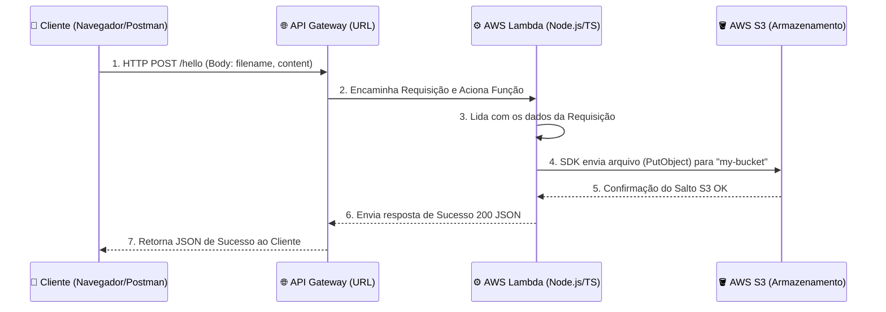

# AWS Lambda TypeScript S3 Integration (LocalStack)

Neste projeto de exemplo, simulamos a integração entre uma **API Gateway**, **AWS Lambda** e **Amazon S3**, rodando 100% no seu computador através do **LocalStack**.

---

## 🏗️ Arquitetura e Fluxo (Caso de Uso Real)

O fluxo consiste numa funcionalidade comum: o usuário chama uma API para realizar o upload de um arquivo na nuvem.

- O usuário envia uma requisição **HTTP POST** contendo um título de arquivo (`filename`) e conteúdo (`content`).
- A requisição passa pelo **API Gateway**, que atua como porta de entrada.
- O API Gateway aciona nossa **AWS Lambda** (a regra de negócio escrita em TypeScript).
- A Lambda usa o **AWS SDK** (biblioteca oficial) para criar um documento lá dentro do serviço de armazenamento, o **Amazon S3**.



---

## 🛠️ Tecnologias Utilizadas

1. **LocalStack:** O coração local! Ele roda via Docker (usando o `docker-compose.yml`) e simula os serviços da nuvem (Lambda, S3 e API Gateway) na porta `4566`.
2. **AWS Lambda:** Nossa computação sem servidor. Código feito em TypeScript (`src/handler.ts`).
3. **AWS S3 (Simple Storage Service):** Serviço de nuvem para armazenar arquivos (fotos, PDFs, .txts). É o HD infinito da AWS.
4. **API Gateway:** Cria as URLs da Web (`Endpoints REST`) que conectam com as peças soltas rodando por trás, como é o caso da nossa Lambda.
5. **AWS SDK v3:** Instalamos a biblioteca `@aws-sdk/client-s3` da Amazon, ela nos permite conversar com os serviços via código (Ex.: instanciar o `S3Client`).
6. **AWS CLI:** Linha de comando para dizer para o LocalStack o que que a gente quer criar. Nossos scripts no `package.json` utilizam exaustivamente isso através dos nomes `aws lambda...` ou `aws s3...`.

---

## 🚀 Passo a Passo (Como Rodar e Testar o Fluxo)

Use os scripts automatizados disponíveis.

### 1. Levantar o simulador (LocalStack)

Se não estiver logado, suba via docker:

```bash
docker compose up -d
```

### 2. Criar a Infraestrutura Externa (Fazer o Deploy Completo)

Primeiro, vamos subir o **Bucket S3** (a pasta onde os arquivos vão ficar salvos na nuvem local):

```bash
npm run s3:local
```

Segundo, fazemos o "deploy" do nosso código zipado da **Lambda**:

```bash
npm run deploy:local # ou npm run update:local caso já exista
```

Terceiro, colocamos tudo na Web através do **API Gateway**:

````bash
npm run api:local
``` *(Guarde a URL gerada por este passo!)*

### 3. Simulando o nosso Caso de Uso do Fluxo!
Agora enviamos através de um teste "Curl" ou Postman nosso arquivo `dados.txt` para o sistema.
Execute trocando `<SUA_URL_API_GATEWAY>` pela URL gerada no passo anterior.

```bash
curl -X POST \
  -H "Content-Type: application/json" \
  -d '{"filename": "teste-s3.txt", "content": "Conteudo super incrivel vindo da request!"}' \
  <SUA_URL_API_GATEWAY>
````

Se tudo deu certo, sua Lambda retornará a confirmação indicando que gravou no S3!

### 4. Como eu confirmo se o S3 realmente salvou?

Você pode listar os arquivos de dentro do seu cofre (Bucket s3) consultando pelo código de linha de comando:

```bash
aws --endpoint-url=http://localhost:4566 --region us-east-1 s3 ls s3://meu-bucket-arquivos/
```
