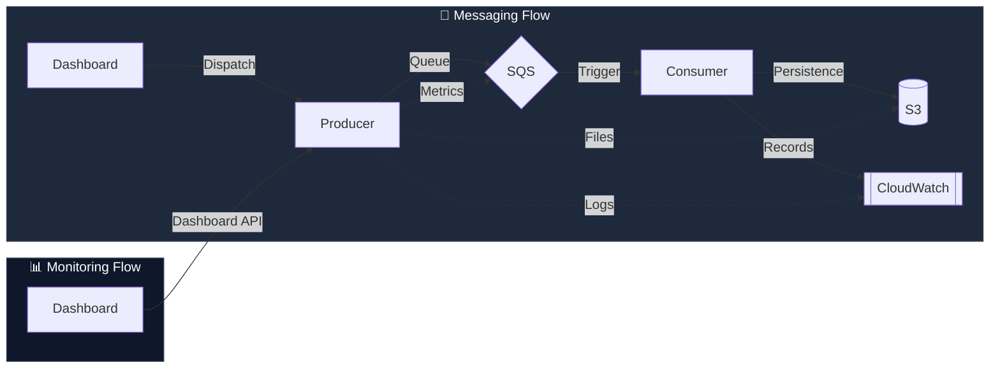

# 🏗️ AWS Serverless Ecosystem: High-Performance SQS & Observability

Este projeto implementa um ecossistema **Serverless Enterprise-Ready**, focado em **Processamento Event-Driven** e **Observabilidade Profunda**. A aplicação automatiza o ciclo de vida de pedidos de e-commerce, utilizando SQS como buffer de carga e S3 para arquivamento definitivo, tudo monitorado por um Dashboard de controle em tempo real.


---

## 🔄 Arquitetura de Eventos & Monitoramento

O ecossistema é dividido em dois processos paralelos: o **Processamento de Pedidos** (Assíncrono) e o **Monitoramento em Tempo Real** (Polling).



---

## 🔮 Funcionalidades de Observabilidade (Deep Dive)

O projeto evoluiu de um teste simples para uma central de diagnóstico completa:

- **SQS Health Center**: Visualização detalhada de mensagens **Visible** (em espera), **In-Flight** (sendo processadas agora) e **Delayed**. Inclui um medidor de pressão de fila que alerta sobre possíveis congestionamentos.
- **Integrated CloudWatch Stream**: Aba dedicada no dashboard que faz o tail automático dos logs da Lambda Consumidora. Visualize erros e confirmações de processamento em tempo real sem abrir o console da AWS.
- **S3 Event Repository**: Tabela administrativa em linhas com **Paginação**, ordenação (mais recentes primeiro) e reporte de tamanho de arquivo.
- **Data Inspector**: Clique em "Details" em qualquer item para inspecionar o JSON bruto persistido no S3 através de um drawer interativo.
- **Métricas de Armazenamento**: Cálculo em tempo real do footprint total de armazenamento (tamanho cumulativo) no seu S3 Data Lake.
- **Stress Testing Suite**: Botões de `Simular x10` e `Simular x30` para gerar carga instantânea e observar a elasticidade da arquitetura.

---

## 🔩 Maturidade Técnica e Deploy

### 🧠 Smart SDK Strategy

Os Gateways (`SQS`, `S3`, `CloudWatch`) utilizam uma lógica de **auto-detecção de ambiente**.

- **LocalStack**: Usa endpoints locais (`localhost:4566`) e credenciais de teste.
- **AWS Real**: Remove as configurações locais e permite que o SDK utilize o comportamento padrão da nuvem (IAM Roles, Endpoints globais). **O mesmo código roda nos dois mundos sem alterações.**

### 📦 Optimized Lambda Package

O pipeline de build (`npm run build:zip`) foi configurado para gerar um artefato profissional:

- **Tree-shaking**: Apenas o código backend e interfaces são incluídos.
- **No Bloat**: Arquivos de UI e configurações de build do frontend são removidos do ZIP, resultando em um pacote leve e de inicialização rápida (Cold Start reduzido).
- **Path Aliases**: Suporte completo a `@src/*` mapeado para caminhos relativos no runtime.

---

## 🚀 Guia de Execução

Inicie o ecossistema completo com um único comando:

```bash
npm run dev:full
```

### Comandos de Utilidade (AWS CLI):

Se desejar validar dados manualmente via terminal (lembrando de usar o seu endpoint local):

```bash
# Ver Logs da Consumidora via CLI
aws --endpoint-url=http://localhost:4566 logs tail /aws/lambda/my-consumer-lambda --watch

# Consultar métricas profundas da fila
aws --endpoint-url=http://localhost:4566 sqs get-queue-attributes \
  --queue-url http://localhost:4566/000000000000/minha-fila-arquivos \
  --attribute-names All

# Listar arquivos no S3
aws --endpoint-url=http://localhost:4566 s3 ls s3://meu-bucket-arquivos --recursive
```

---

**Built with Clean Architecture, SOLID and Cloud-Native best practices.**
