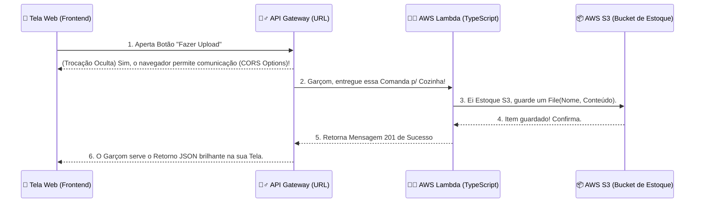

# S3 Gateway Uploader - Serverless Completo no LocalStack

Este projeto deixou de ser apenas um script brincando no terminal e virou uma **Aplicação Completa e Visual**. Agora temos um Frontend bonitão feito em HTML comunicando diretamente com nossos serviços simulados da AWS (API Gateway -> Lambda -> S3)! Tudo rodando offline!

---

## 🏗️ Como Funciona o Fluxo Atual (De forma bem simples!)

Imagine que o sistema que construímos é um restaurante Fast-Food.

1. **📱 Você (O Frontend / Cliente)**
   É o aplicativo rodando no seu navegador (aquele formulário que abriu no Vite). Você escolhe o lanche (escreve o nome do arquivo) e o recheio (digita o conteúdo do texto) e clica no botão "Fazer Upload".

2. **🤵‍♂️ O Garçom (API Gateway)**
   Sua tela manda tudo através daquela "URL gigante" para o API Gateway. O API é o garçom! Ele recebe a sua comanda, anota as informações de segurança (Header, CORS) e leva o seu pedido lá pra dentro da cozinha de forma segura. O seu navegador nunca entra na cozinha.

3. **👨‍🍳 O Cozinheiro Chefe (AWS Lambda)**
   O garçom entrega o pedido na mão do Cozinheiro (a nossa Função TypeScript `handler.ts`). A função valida se veio "nome" e "conteúdo". Tudo certo? O cozinheiro embrulha tudo num pacote perfeito e entrega pro estoque.

4. **📦 O Salão de Estoque (Amazon S3)**
   O cozinheiro envia o pacote para ser guardado na nossa caixa "meu-bucket-arquivos" (Que instanciamos via bash). O estoque guarda o arquivo e devolve um rádio pro cozinheiro: _"Tudo salvo no servidor!"_.

5. **🧾 A Entrega na Mesa (Retorno JSON)**
   A Lambda monta uma Nota Fiscal de sucesso (Status 201 Created), entrega pro API Gateway (O Garçom), que anda até a sua mesa e plota aquele código visual JSON verdinho na sua tela confirmando. Fim do fluxo! Tudo ocorreu em milissegundos.



---

## 🕹️ Como Iniciar Todo o Projeto (Passo a Passo)

### 1. Inicie o Simulador da AWS

Se o seu LocalStack não estiver rodando no Docker, suba ele:

```bash
docker compose up -d
```

### 2. Prepare a Infraestrutura com Nossos Atalhos Automáticos

Pelo terminal, na raiz do projeto, digite nessa ordem:

```bash
npm run s3:local      # Cria a sala do Estoque (Cria o Bucket)
npm run deploy:local  # Ensaia e Contrata o Cozinheiro (Compila o TS e joga na AWS)
npm run api:local     # Contrata o Garçom para atender as mesas (Cria a URL Publica /hello)
```

_(⚠️ Guarde aquela URL do "Postman" que esse último comando jogar na tela)_

### 3. Inicie a Interface Gráfica / Aplicação Visual

Nós colocamos o Vite na raiz do projeto. Agora precisamos que ele mostre o nosso site.

```bash
npm run dev
```

Clique no link `http://localhost:5174/` que aparecer no terminal e seu Front-End irá abrir!

### 4. Brinque no Site!

- Cole aquela **URL gigante** (Terminando em `/hello`) da etapa 2 no primeiro espaço do site.
- Informe o nome ("documento-secreto.txt") e um texto qualquer.
- O Retorno do S3 aparecerá chique logo abaixo!

> Nota Importante sobre Estudo: Caso altere ou queira brincar no arquivo `src/handler.ts` (O Backend na AWS Lambda), lembre-se de sempre rodar `npm run update:local` de novo para compilar a novidade pra nuvem antes de testar a URL de novo! As mudanças no Frontend (Vite) não precisam disso, elas aparecem na mesma hora.
